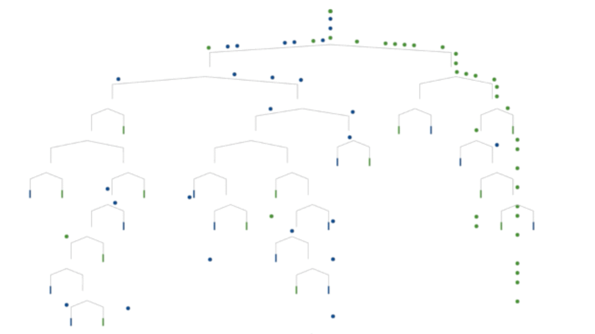

```{r knitr_init, echo=FALSE, results="asis", cache=FALSE}
library(knitr)
library(rmdformats)
library(shinyparticles)
## Global options
options(max.print = "75")
opts_chunk$set(echo = FALSE,
	             cache = FALSE,
               prompt = FALSE,
               tidy = FALSE,
               comment = NA,
               message = FALSE,
               warning = FALSE)
opts_knit$set(width = 75)
particles("conf.json")
```

<link href="https://use.fontawesome.com/releases/v5.0.7/css/all.css" rel="stylesheet">

#  <i class="fas fa-cogs"></i> Pré-traitement des données

## Protéase du VIH

On s’intéresse dans ce projet à la protéase du VIH, une enzyme qui possède un rôle majeur dans le cycle du
virus du SIDA. Cette enzyme permet en effet le clivage de certaines protéines, ce qui a pour effet de libérer et de créer d’autres protéines néfastes à l’organisme et d’aider la propagation de la maladie. 

Pour mieux comprendre comment fonctionne la protéase du VIH, on dispose d’une base de données contenant un ensemble d’octamères (i.e. une séquence de 8 acides aminés), dont certains ont été clivés par la protéase et d’autres non.


**L’objectif de l’étude est de prédire, à partir de sa séquence d’acides aminés, si un octamère est clivé ou
non par la protéase du VIH.**

## Pré-traitement des données

La base de données contient deux variables : la première variable `Octamer` correspond à la séquence d’acides aminés composant l’octamère, et la deuxième variable `Clived` vaut 1 si l’octamère a été clivé par la protéase, et -1 sinon.


```{r echo=TRUE}
library(readr)
data1625 <- read_csv("1625Data.txt") # On importe la table
head(data1625) # on affiche les 6 premières lignes 
```

<p style="color:#AE2573; font-size:200%;"> 1 </p>

A partir de la séquence de 8 lettres, on construit 8 variables qualitatives contenant chacune une des lettres de la séquence.

```{r echo=TRUE}
X<-strsplit(as.character(data1625$Octamer),'',fixed=FALSE)
df <- data.frame(matrix(unlist(X), nrow=length(X), byrow=T))
colnames(df)<-c('v1','v2','v3','v4','v5','v6','v7','v8')
data1625<- cbind(data1625,df)[,-1]

head(data1625)
```

<p style="color:#AE2573; font-size:200%;"> 2 </p>

On recode la variable cible `Clived` en un class `factor` valant 0 ou 1.

```{r echo=TRUE}
data1625$Clived<-factor(data1625$Clived,labels = c(0,1))
str(data1625)
```


<p style="color:#AE2573; font-size:200%;"> 3 </p>

La proportion d’octamères clivés : 

```{r echo=TRUE}
library(highcharter)

highchart() %>% 
  hc_chart(type = "pie") %>% 
  hc_add_series(data1625$Clived, innerSize='50%') %>% 
  hc_plotOptions(
    pie=list(
      allowPointSelect= TRUE,
            cursor= 'pointer',
            dataLabels=list(
                enabled= TRUE,
                format= '<b>{point.name}</b>: {point.percentage:.1f} %'
            )
    )
  ) 

```

<p style="color:#AE2573; font-size:200%;"> 4 </p>

On partionne la base en deux parties : entrainement $75$% et test $25$%, on utilise la fonction `createDataPartition` du package `caret`

```{r echo=TRUE}
library(caret)

set.seed(123) # fixer la graine de l'aléa pour reproduire les memes résultats 
trainIndex <- createDataPartition(data1625$Clived , p = .75, list = FALSE)

data.Train <- data1625[ trainIndex,]
data.Test  <- data1625[-trainIndex,]
```


<p style="color:#AE2573; font-size:200%;"> 5 </p>


On construit le meilleur classifieur naif _constant_ à partir de la base d’apprentissage ( ie attribue à toutes observation la même classe dominante)

```{r}
# la fonction prend en paramètre une table et retourne la meme table en ajoutant la 
# variable ypred qui vaut 0 (classe majoritaire)
classifieur_naif<-function(df){
  df$ypred <- 0
  return(df)
}
```


le taux d'erreur sur la base de test correspond à la proportion de la classe `1` présente dans la base :

```{r echo=TRUE}
nrow(data.Test[which(data.Test$Clived==1),])/nrow(data.Test)
```


# <i class="fas fa-tree"></i>  Arbres de décision CART


Comme les arbres CART sont à la base de la plupart des méthodes ensemblistes, on commence par étudier les performances obtenues sur un arbre individuel.




<p style="color:#AE2573; font-size:200%;"> 6 </p>


On construit  une fonction qui prend en entrée un vecteur de prédictions `ypred` (sous la forme `0` ou `1`) et un vecteur contenant les vraies classes `yobs`, et qui calcule le taux d’erreur associé.

```{r echo=TRUE}

taux.erreur<-function(ypred,yobs){
  return(1-sum(ypred==yobs)/length(ypred))
}

```


<p style="color:#AE2573; font-size:200%;"> 7 </p>

On construit un arbre de décision avec la fonction `rpart`, en gardant les réglages par défaut.


```{r echo=TRUE}
library(rpart) # construction de l'arbre 
library(sparkline) # dependance pour l'affichage de l'arbre
library(visNetwork) # affichage de l'arbre 


model1 <- rpart(data.Train$Clived ~., data = data.Train)

visTree(model1,legend=FALSE,export=FALSE) # on affiche l'arbre 

```

On calcule le taux d’erreur sur la base de test.


```{r echo=TRUE}
preds <- predict(model1, newdata = data.Test, type = c("class")) # on calcul d'abord les prédictions de l'arbre
taux.erreur(preds,data.Test$Clived)
```


Le taux d'erreur est de `r  round(taux.erreur(preds,data.Test$Clived),4)` ! 

<p style="color:#AE2573; font-size:200%;"> 8 </p>

On construit un arbre de décision profond, en modifiant les options `maxdepth`, `minbucket` et `cp`. 

```{r echo=TRUE}

options.profond =list(maxdepth=20, minbucket= 1, cp = 0 )
model.profond <- rpart(data.Train$Clived ~., data = data.Train, control =options.profond)

visTree(model.profond, legend=FALSE,export=FALSE)
```

On calcule ensuite le taux d’erreur sur la base de test.


```{r echo=TRUE}
preds.profond <- predict(model.profond, newdata = data.Test, type = c("class")) # on calcul d'abord les prédictions de l'arbre
taux.erreur(preds.profond ,data.Test$Clived)
```


Le taux d'erreur est de `r  round(taux.erreur(preds.profond ,data.Test$Clived),4)` ! 

<p style="color:#AE2573; font-size:200%;"> 9 </p>


On construit un arbre de décision de niveau 1 (avec seulement 1 noeud) 

```{r}
options.stump =list(maxdepth=1, minbucket= 30, cp = 0 )
model.stump <- rpart(data.Train$Clived ~., data = data.Train, control =options.stump)

visTree(model.stump, legend=FALSE,export=FALSE)
```

On calcule le taux d’erreur sur la base de test.


```{r echo=TRUE}
preds.stump <- predict(model.stump, newdata = data.Test, type = c("class")) # on calcul d'abord les prédictions de l'arbre
taux.erreur(preds.stump ,data.Test$Clived)
```


Le taux d'erreur est de `r  round(taux.erreur(preds.stump ,data.Test$Clived),4)` ! 

<p style="color:#AE2573; font-size:200%;"> 9 </p>


```{r echo=TRUE}
res.arbres <- data.frame(
  arbre = c("defaut", "profond", "stump"), 
  tx_err= c(round(taux.erreur(preds ,data.Test$Clived),4), 
              round(taux.erreur(preds.profond,data.Test$Clived),4), 
              round(taux.erreur(preds.stump ,data.Test$Clived),4) 
           )
)

hchart(res.arbres, "bar", hcaes(x = "arbre", y = "tx_err" ), colorByPoint= TRUE) %>% 
    hc_plotOptions(
    bar= list(
       dataLabels= list(
                enabled= TRUE
       )
    )
  ) %>% 
  hc_add_theme(hc_theme_flatdark())
```

<p style="color:#AE2573; font-size:200%;"> 10 </p>

En constate que l'arbre de niveau 1 est le mois précis de tous, qui au final n'utilise qu'une seule variable (qui correspond à la quatrième lettre de la séquence d'acide aminé : v4) et donc n'apprend pas suffisament, puis l'arbre profond qui au contraire se colle aux donnée de la base d’apprentissage : d'où le risque de sur-apprentissage, finalement le meilleur modèle est l'arbre par défaut avec le paramètrage par défaut.  

# <i class="fas fa-sitemap"></i>  Bagging

Le bagging permet de réduire la variance d’un classifieur par aggrégation. Il est donc particulièrement
adapté lorsque le classifieur de base a un faible biais et une forte variance. Nous allons tester (vérifier) cette
propriété.

__Principe et algorithme__ : Soit $Y$ une variable à expliquer quantitative ou qualitative, $X^1, ... , X^p$
les variables explicatives et $f(x)$ un modèle fonction de $x = {x^1, . . . , x^p} ∈ \mathbb{R}^p$.
On note $n$ le nombre d’observations et
$$z = \{(x_1, y_1), . . . ,(x_n, y_n)\}$$
un échantillon de loi $F$.

Considérant $B$ échantillons indépendants notés $\{z_b\}_{b=1,B}$, une prévision
par agrégation de modèles est définie ci-dessous dans le cas où la variable à
expliquer $Y$ est : 

+ quantitative : $\hat{f}_B(.) = \frac{1}{B} \sum_{b=1}^B \hat{f}_{z_b}(.)$ ,
+ qualitative : $\hat{f}_B(.) =  arg \quad max_j \quad card\{b | \hat{f}_{z_b}(.)=j \}$

Dans le premier cas, il s’agit d’une simple moyenne des résultats obtenus pour
les modèles associés à chaque échantillon, dans le deuxième, un comité de
modèles est constitué pour voter et élire la réponse la plus probable. Dans ce
dernier cas, si le modèle retourne des probabilités associées à chaque modalité
comme en régression logistique ou avec les arbres de décision, il est aussi
simple de calculer des moyennes de ces probabilités.

Le principe est élémentaire, moyenner les prévisions de plusieurs modèles
indépendants permet de réduire la variance et donc de réduire l’erreur de prévision.

Cependant, il n’est pas réaliste de considérer $B$ échantillons indépendants.

Cela nécessiterait généralement trop de données. Ces échantillons sont donc
remplacés par $B$ réplications d’échantillons bootstrap obtenus chacun par n
tirages avec remise selon la mesure empirique $\hat F$. Ceci conduit à l’algorithme
ci-dessous.


***********
**Algorithm **:  _Bagging_

***********

 Soit $x_0$ à prévoir et  
 $z = \{(x_1, y_1), . . . ,(x_n, y_n)\}$ un échantillon  
 **for** $b=1$ à $B$ **do**  
 
 + Tirer un échantillon bootstrap $z^*_b$  
 + Estimer $\hat{f}_{z_b}(x_0)$  sur l’échantillon bootstrap.
 
 **end for**  

Calculer l’estimation moyenne $\hat{f}_B(x_0) = \frac{1}{B} \sum_{b=1}^B \hat{f}_{z_b}(x_0)$ ou le résultat du vote.

******


<p style="color:#AE2573; font-size:200%;"> 11 </p>

On charge le package `adabag`

```{r echo=TRUE}
library(adabag)
```

<p style="color:#AE2573; font-size:200%;"> 12 </p>

On construit un modèle de bagging à l’aide de la fonction bagging avec `mfinal`$=20$ arbres, en laissant
les autres réglages par défaut.

```{r echo=TRUE}
model.bagg <- bagging(Clived ~., data = data.Train, mfinal = 20)

```


On calcule le taux d’erreur sur la base de test.


```{r echo=TRUE}
preds.bagg <- predict(model.bagg, newdata = data.Test)$class # on calcul d'abord les prédictions de l'arbre
t_bag1<-taux.erreur(preds.bagg ,data.Test$Clived)
```


Le taux d'erreur est de `r  round(taux.erreur(preds.bagg,data.Test$Clived),4)` ! 

<p style="color:#AE2573; font-size:200%;"> 13 </p>

On construit un modèle de bagging avec 20 arbres de décision à 1 noeud. 

```{r echo=TRUE}
model.bagg.stump <- bagging(Clived ~., data = data.Train, mfinal = 20, control = options.stump)
```


On calcule le taux d’erreur sur la base de test.


```{r echo=TRUE}
preds.bagg.stump <- predict(model.bagg.stump, newdata = data.Test)$class # on calcul d'abord les prédictions de l'arbre
t_bag2<-taux.erreur(preds.bagg.stump ,(data.Test$Clived))
```

Le taux d'erreur est de `r  round(taux.erreur(preds.bagg.stump ,(data.Test$Clived)),4)` ! 

<p style="color:#AE2573; font-size:200%;"> 14 </p>


```{r echo=TRUE}
model.bagg.prof <- bagging(Clived ~., data = data.Train, mfinal = 20, control = options.profond)

```


On calcule le taux d’erreur sur la base de test.


```{r echo=TRUE}
preds.bagg.prof <- predict(model.bagg.prof, newdata = data.Test)$class # on calcul d'abord les prédictions de l'arbre
t_bag3<-taux.erreur(preds.bagg.prof ,(data.Test$Clived))
```

Le taux d'erreur est de `r  round(taux.erreur(preds.bagg.prof ,(data.Test$Clived)),4)` ! 

<p style="color:#AE2573; font-size:200%;"> 15 </p>

Comparons les taux d’erreur obtenus avec chaque méthode.

```{r echo=TRUE}
res.bagg <- data.frame(
  model = c("defaut", "stump","profond"), 
  tx_err= c(round(taux.erreur(preds.bagg ,data.Test$Clived),4), 
              round(taux.erreur(preds.bagg.stump,data.Test$Clived),4), 
              round(taux.erreur(preds.bagg.prof ,data.Test$Clived),4)
            
))

hchart(res.bagg, "bar", hcaes(x = "model", y = "tx_err" ), colorByPoint= TRUE) %>% 
  hc_plotOptions(
    bar= list(
       dataLabels= list(
                enabled= TRUE
       )
    )
  ) %>% 
  hc_add_theme(hc_theme_flatdark())
```


Le bagging avec des arbres à noeud unique va toujour fournir le même résultat car chacun des 20 arbre utilise (bagging utilise tous les variable pendant la recherche des variable discriminantes) la variable v4 (la plus discriminante).

>On voit clairement l'améloiration apportée par le bagging sur la pérfomance du modèle profond! 


On test maintenant l'effet du nombre d'arbres, en calculant le taux d’erreur moyen sur 10 répétitions du modèle profond, pour des valeurs de mfinal égales à 1, 2, 5, 10, 20 et 50.

>`R` est un language vectorisé, on doit éviter au maximum les boucles `for`, dans ce cas on utilise la fonction `sapply` pour itérer une fonction sur un veceur de paramètres et `replicate` pour répéter 10 fois :


```{r  echo=TRUE}

compar <- replicate(10,
          sapply( c(1,2,5,10,20,50), function(x) taux.erreur(predict(bagging(Clived ~., data = data.Train, mfinal = x, control = options.profond), newdata = data.Test)$class ,(data.Test$Clived))),simplify = FALSE
) 

df <- data.frame(mfinal= c("1","2","5","10","20","50"), 
           tx_err= sapply(data.frame(matrix(unlist(compar), nrow=length(compar), byrow=T)) ,mean) )


hchart(df, "column", hcaes(x = "mfinal", y = "tx_err" ), colorByPoint= TRUE) %>% 
  hc_plotOptions(
    column= list(
       dataLabels= list(
                enabled= TRUE
       )
    )
  ) 
```


## Forêts aléatoires:

Les forêts aléatoires sont un cas particulier d’algorithme de bagging appliqué aux arbres CART.  

Le bagging est appliqué à des arbres binaires de décision en ajoutant un tirage aléatoire de $m$ variables explicatives parmi les $p$


******
**Algorithm **:  _Forêts Aléatoires_

******

 Soit $x_0$ à prévoir et  
 $z = \{(x_1, y_1), . . . ,(x_n, y_n)\}$ un échantillon  
 **for** $b=1$ à $B$ **do**  
 
 + Tirer un échantillon bootstrap $z^*_b$  
 + Estimer un arbre sur cet échantillon avec _randomisation_ des variables
 
 **end for**  

Calculer l’estimation moyenne $\hat{f}_B(x_0) = \frac{1}{B} \sum_{b=1}^B \hat{f}_{z_b}(x_0)$ ou le résultat du vote.

******


Nous allons tester l’effet des différents réglages de l’algorithme. On a vu en cours que la pratique consistait à choisir
des arbres profonds et un valeur “faible” du nombre de variables utilisées pour construire chaque arbre.

<p style="color:#AE2573; font-size:200%;"> 16 </p>

On charge le package `randomForest` qui ne fait qu’interfacer le programme original développé en `Fortran` par Léo Breiman et Adele Cutler

```{r echo=TRUE}
library(randomForest)
```


<p style="color:#AE2573; font-size:200%;"> 17 </p>


```{r echo=TRUE}
set.seed(123)

library(dplyr)
check_mtry <- replicate(10,
          sapply( c(1,2,5,8), function(x) taux.erreur(predict(randomForest(Clived ~., data = data.Train,ntree=20,mtry=x), newdata = data.Test) ,(data.Test$Clived))),simplify = FALSE
) 

d <- data.frame(mtry= c("1","2","5","8"), 
           tx_err= sapply(data.frame(matrix(unlist(check_mtry), nrow=length(check_mtry), byrow=T)) ,mean) )


hchart(d, "column", hcaes(x = "mtry", y = "tx_err" ), colorByPoint= TRUE) %>% 
  hc_plotOptions(
    column= list(
       dataLabels= list(
                enabled= TRUE
       )
    )
  )

```


la valeur optimal de `mtry`$=1$, on voit clairemet l'impact de nomrbre de variables aléatoires choisit pendant la construction de chaque arbre, _un faible_ nombre implique des arbres qui sont peu  corrélés ce qui entraîne une baisse de la variance globale après aggrégation.


<p style="color:#AE2573; font-size:200%;"> 18 </p>


```{r echo=TRUE, eval=FALSE, include=FALSE}
set.seed(123)

library(dplyr)
check_ntree <- replicate(10,
          sapply( c(1, 2, 5, 10, 20, 50, 100, 200, 500), function(x) taux.erreur(predict(randomForest(Clived ~., data = data.Train,ntree=x,mtry=1), newdata = data.Test) ,(data.Test$Clived))),simplify = FALSE
) 

l <- data.frame(ntree= c("1","2","5","10","20","50","100","200","500"), 
           tx_err= sapply(data.frame(matrix(unlist(check_ntree), nrow=length(check_ntree), byrow=T)) ,mean) )


hchart(l, "column", hcaes(x = "ntree", y = "tx_err" ), colorByPoint= TRUE) %>% 
  hc_plotOptions(
    column= list(
       dataLabels= list(
                enabled= TRUE
       )
    )
  ) 

```


# <i class="fas fa-bolt"></i>  Boosting

On s’intéresse maintenant aux méthodes de boosting, qui contrairement aux méthodes de bagging, ne
construisent pas des arbres de décision en parallèle, mais de façon séquentielle, chaque arbre se concentrant
d’avantage sur les individus les moins bien classés par l’arbre précédent. Ces méthodes fonctionnent bien
lorsque les classifieurs sont faibles (fort biais et donc fort variance).

## AdaBoost:

Dans la version originelle de l’algorithme `Adaboost`, chaque observation est pondérée par un
poids $w_i$ , et aucune source d’aléa n’est introduite contrairement aux méthodes de bagging. Les résultats de
l’algorithme sont donc déterministes : si on lance plusieurs fois la méthode sur le même jeu de données, on
obtient exactement les mêmes résultats.


<p style="color:#AE2573; font-size:200%;"> 19 </p>

On construit un modèle basé sur l'algorithme `Adaboost`, avec 20 itérations :

```{r}
library(adabag)
adaboost <- boosting(Clived ~., data=data.Train,  boos = TRUE,mfinal=20)
t_boost_1<-taux.erreur(predict(adaboost,newdata = data.Test)$class,data.Test$Clived)
```

Son taux d'erreur est : ```{r} t_boost_1```

<p style="color:#AE2573; font-size:200%;"> 20 </p>

On construit le meme  modèle mais cette fois à 1 noeud 


```{r }
t_boost_2<-taux.erreur(predict(boosting(Clived ~., data=data.Train,  boos = TRUE,mfinal=20,control=rpart.control(maxdepth=1)),newdata = data.Test)$class,data.Test$Clived)
```

<p style="color:#AE2573; font-size:200%;"> 21 </p>


```{r }
t_boost_3<-taux.erreur(predict(boosting(Clived ~., data=data.Train,  boos = TRUE,mfinal=20,control=rpart.control(maxdepth=20)),newdata = data.Test)$class,data.Test$Clived)
```

<p style="color:#AE2573; font-size:200%;"> 22 </p>

Comparaison : Boosting vs Bagging


```{r echo=TRUE}
library(dplyr)
compa <- data.frame(tx_er=c(t_boost_1,t_boost_2,t_boost_3,t_bag1,t_bag2,t_bag3),
                    model=c("default","stump","profond","default","stump","profond"),
                    method=c("boosting","boosting","boosting","bagging","bagging","bagging")
                    )

hchart(compa, "column", hcaes(x = "model", y = "tx_er" ,group = "method"), color = c("#0aaffc", "#0afc6f")) %>% 
  hc_plotOptions(
    column= list(
       dataLabels= list(
                enabled= TRUE
       )
    )
  ) 


```


## XGBoost:


`XGBoost` n’est pas une méthode spécifique, mais une implémentation efficace des méthodes du
gradient boosting. Sous `R`, cette librairie est disponible dans le package xgboost. Ce package fonctionne un
peu différemment des précédents, et a sa propre syntaxe.

<p style="color:#AE2573; font-size:200%;"> 23 </p>

On charge le package `xgboost`

```{r echo=TRUE}
library(xgboost)
```


<p style="color:#AE2573; font-size:200%;"> 24 </p>

L’encodage one-hot:


```{r}
new_tr <- model.matrix(~.+0,data = data.Train[,2:9]) 
new_ts <- model.matrix(~.+0,data = data.Test[,2:9])

```


<p style="color:#AE2573; font-size:200%;"> 25 </p>

Création de deux objets contenant respictivement la base d'apprentissage etla base  de test 

```{r}
#convert factor to numeric 
labels <- as.numeric(data.Train$Clived)-1
ts_label <- as.numeric(data.Test$Clived)-1
```


```{r}
dtrainXG <- xgb.DMatrix(data = new_tr,label = labels) 
dtestXG <- xgb.DMatrix(data = new_ts,label   =ts_label)
w<-list(train=dtrainXG,test=dtestXG)

```


<p style="color:#AE2573; font-size:200%;"> 26 </p>

Application d'algorithe de gradient boosting adapté à la classification binaire avec un nombre des iteration $nrounds=20$


```{r echo=TRUE}
xgb.fit=xgb.train(nrounds=20,data=dtrainXG,watchlist=w,objective = "binary:logistic", verbose = FALSE, params = list(eval_metric="error"))
xgb.fit
```

le taux d'erreur

```{r}
min(xgb.fit$evaluation_log$test_error)
```

<p style="color:#AE2573; font-size:200%;"> 27 </p>

Test de l'effet des parametresde l'algorithme :

+ maxdepth (1,5,10,20):


```{r echo=TRUE}


library(highcharter)
eff_depth<-sapply( c(1,2,5,10,20,50), function(x) (xgb.fit=xgb.train(nrounds=20,data=dtrainXG,watchlist=w,objective = "binary:logistic",maxdepth= x, verbose = FALSE, params = list(eval_metric="error"))$evaluation_log$test_error))


```

```{r echo=TRUE}
tauxerr=data.frame(matrix(unlist(eff_depth), nrow=length(eff_depth)))
```


# <i class="fas fa-flag-checkered"></i> Conclusion


Deux types d’algorithmes ont été abordés. Ceux reposants sur une construction aléatoires d’une famille de modèles : _bagging_ pour _bootstrap aggregating_ (Breiman 1996) et les forêts aléatoires (_random forests_) de Breiman (2001) qui propose une amélioration du bagging spécifique aux modèles définis par des arbres binaires (CART).  
Ceux basés sur le _boosting_ (Freundet Shapiro,1996) et qui reposent sur une construction adaptative, déterministe ou aléatoire, d’une famille de modèles. Ces algorithmes se sont développés à la frontière entre apprentissage machine ( _machine learning_ ) et Statistique.

Les principes du bagging ou du boosting s’appliquent à toute méthode de modélisation (régression, CART, réseaux de neurones) mais n’ont d’intérêt, et réduisent sensiblement l’erreur de prévision, que dans le cas de modèles instables.Ils sont surtout mis en œuvre en association avec des arbres binaires comme modèles de base. En effet, l’instabilité déjà soulignés des arbres apparaît alors comme une propriété nécessaire à la réduction de la variance par agrégation de modèles.


